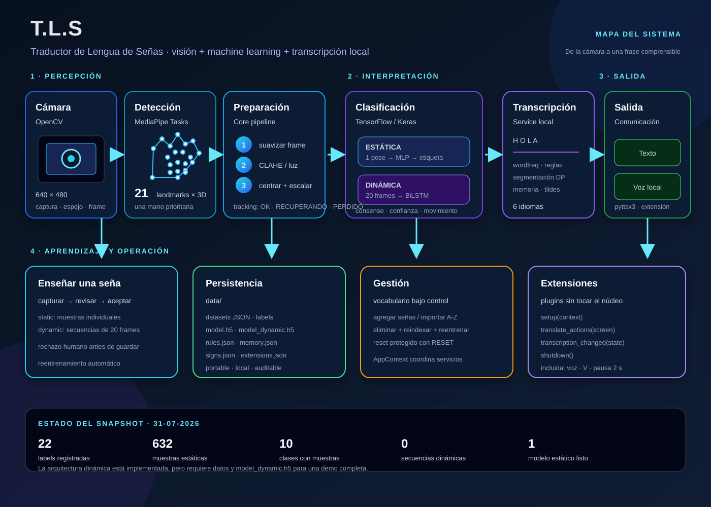

# T.L.S — Presentación integral del proyecto

> **Traductor de Lengua de Señas** · Proyecto Inicial IWG400 · Grupo 7 · 2026  
> Documento preparado para exposición, demostración y defensa técnica.

**Material técnico ampliado:** [Anexo técnico avanzado](anexo_tecnico_avanzado_tls.md) · [Índice y números](indice_y_numeros_tls.md)



---

## Cómo usar este documento

- Las secciones `Diapositiva` funcionan como un guion de presentación.
- Las notas `Qué decir` son una respuesta oral breve.
- Las tablas técnicas sirven para responder preguntas del jurado.
- Los valores marcados como **estado actual** corresponden a la revisión del repositorio realizada el **31-07-2026**; no deben confundirse con el alcance diseñado del sistema.

---

# Guion de exposición

## Diapositiva 1 — Título y propuesta de valor

### T.L.S: Traductor de Lengua de Señas

Aplicación de escritorio capaz de:

1. Capturar una mano desde una cámara web.
2. Convertirla en 21 puntos anatómicos o *landmarks*.
3. Reconocer señas estáticas y, mediante secuencias, señas dinámicas.
4. Convertir las etiquetas reconocidas en texto natural.
5. Emitir la frase por voz local mediante una extensión opcional.
6. Aprender nuevas señas y correcciones sin modificar el código principal.

### Frase de apertura

> T.L.S. busca reducir la barrera de comunicación entre personas sordas y oyentes mediante una aplicación local que aprende el vocabulario de señas a partir de ejemplos capturados por el propio usuario.

### Qué decir en 20 segundos

> El sistema no intenta interpretar la imagen completa como una caja negra. Primero detecta la estructura de la mano con MediaPipe, la representa con 21 puntos y luego utiliza modelos entrenados por el usuario para reconocer cada seña. Después agrega estabilización, transcripción inteligente, memoria de correcciones y voz local.

---

## Diapositiva 2 — Problema, motivación y objetivos

### Problema

La comunicación cotidiana puede volverse difícil cuando una persona usa lengua de señas y su interlocutor no la conoce. Las soluciones existentes pueden depender de internet, de un vocabulario cerrado o de hardware adicional.

### Objetivo general

Crear un software capaz de aprender señas a partir de fotogramas y de la forma/movimiento de la mano, y traducirlas a texto y voz.

### Objetivos específicos

- Detectar la forma y posición de la mano.
- Reconocer poses fijas y movimientos.
- Transformar letras o tokens en frases legibles.
- Permitir que el usuario agregue vocabulario.
- Mantener la operación local y modular.

### Alcance

**Incluido:** aplicación de escritorio, cámara web, reconocimiento estático, pipeline dinámico, entrenamiento local, transcripción, memoria, voz y extensiones.  
**Fuera del alcance declarado:** integración con Arduino Uno Q por restricciones de tiempo y hardware.

### Respuesta si preguntan por el usuario objetivo

El prototipo está pensado para una persona que necesita comunicarse mediante señas, un acompañante oyente y un usuario técnico que puede ampliar el vocabulario del sistema.

---

## Diapositiva 3 — Qué puede hacer la aplicación

| Módulo visible | Función | Resultado |
|---|---|---|
| **Entrenamiento** | Captura estática o dinámica y revisa un resumen | Dataset actualizado y modelo reentrenado |
| **Gestionar señas** | Agrega nombres, importa el alfabeto occidental, elimina o resetea | Registro y labels consistentes |
| **Traducir en vivo** | Abre cámara, detecta landmarks y clasifica | Letras, token actual y frase |
| **Extensiones** | Activa/desactiva plugins sin editar el núcleo | Funcionalidades opcionales |
| **Manual/Créditos** | Lee documentación Markdown dentro de la app | Ayuda integrada |

### Flujo de usuario recomendado

```text
Gestionar señas → Enseñar seña → Revisar resumen → Aceptar → Reentrenar → Traducir en vivo
```

### Controles principales

- **Entrenamiento estático:** `T` captura una muestra; `Q` termina la sesión.
- **Entrenamiento dinámico:** `T` inicia/detiene una secuencia; `Q` termina.
- **Corrección de interpretación:** `C` abre el diálogo de aprendizaje.
- **Traducción:** botones para iniciar/detener, borrar letra, limpiar texto y cambiar idioma.
- **Voz:** botón `Repetir frase (V)` cuando la extensión `voz` está activa.

---

## Diapositiva 4 — Arquitectura general

```text
┌─────────────────────────────────────────────────────────────┐
│                       desktop_app.py                         │
│                  QApplication + MainWindow                  │
└─────────────────────────────┬───────────────────────────────┘
                              │
                   QStackedWidget / Signals
                              │
┌─────────────────────────────▼───────────────────────────────┐
│                         app/                                 │
│  Home · TeachSign · ManageSigns · Translate · Extensions     │
│  Widgets reutilizables · navegación                          │
└─────────────────────────────┬───────────────────────────────┘
                              │ AppContext
┌─────────────────────────────▼───────────────────────────────┐
│                       services/                               │
│ Paths · Signs · Captures · Training · Transcription          │
│ Library · Documents · Extensions                             │
└───────────────┬──────────────────┬──────────────────────────┘
                │                  │
       ┌────────▼────────┐ ┌───────▼────────┐
       │      core/      │ │      ml/        │
       │ cámara, visión  │ │ modelos y       │
       │ y normalización │ │ clasificadores  │
       └────────┬────────┘ └───────┬────────┘
                │                  │
                └────────┬─────────┘
                         ▼
                data/ + extensions/
```

### Decisiones de diseño

- **Separación UI/servicios:** las pantallas no deberían conocer todos los detalles de JSON o TensorFlow.
- **`AppContext`:** crea una sola instancia compartida de rutas, registro, captura, entrenamiento, transcripción y extensiones.
- **`QStackedWidget`:** permite navegar entre pantallas sin abrir múltiples ventanas.
- **Archivos locales:** hacen que datasets, labels, reglas y memoria sean portables y auditables.
- **Extensiones:** agregan capacidades sin modificar `MainWindow` ni el pipeline central.

### Archivos de referencia

- Entrada: `desktop_app.py`
- Ventana/navegación: `app/main_window.py`
- Contenedor: `app/app_context.py`
- Rutas: `services/path_service.py`

---

## Diapositiva 5 — Flujo de datos en tiempo real

```text
Cámara web
   ↓ OpenCV: captura, espejo, 640×480
Frame preprocesado
   ↓ resize + GaussianBlur + CLAHE + normalización de iluminación
MediaPipe Hand Landmarker
   ↓ una mano, 21 landmarks (x, y, z)
Estabilización
   ↓ suavizado exponencial + tolerancia a frames perdidos
┌───────────────────────────────┬──────────────────────────────┐
│ Predicción estática           │ Predicción dinámica           │
│ 1 frame → MLP → etiqueta      │ cola de 20 frames → BiLSTM    │
└───────────────────────────────┴──────────────────────────────┘
                 ↓ selección: dinámica tiene prioridad
      confianza + consenso temporal + estado de movimiento
                              ↓
              TranscriptionService: token → texto
                              ↓
                   pantalla / memoria / extensión voz
```

### Qué ocurre por frame

1. `cv2.VideoCapture(0)` obtiene un frame.
2. Se invierte horizontalmente para que la cámara sea intuitiva.
3. `ImageProcessor` normaliza tamaño, ruido, contraste e iluminación.
4. `HandDetector` devuelve una lista de manos con 21 puntos cada una.
5. La pantalla suaviza la trayectoria y conserva temporalmente el último frame válido.
6. Se evalúan los clasificadores disponibles.
7. El resultado pasa a la transcripción y se actualiza la interfaz.
8. Se dibujan puntos, conexiones, texto, tracking y FPS sobre el video.

### Estados de tracking

- `OK`: mano detectada y válida.
- `RECUPERANDO`: se reutiliza el último landmark durante algunos frames perdidos.
- `PERDIDO`: no hay una mano confiable; se reinicia el estado dinámico.

---

## Diapositiva 6 — Representación de la mano

### ¿Qué es un landmark?

Es un punto anatómico clave de la mano. MediaPipe entrega 21 puntos, cada uno con coordenadas normalizadas `(x, y, z)`:

- `x`, `y`: posición relativa dentro de la imagen.
- `z`: profundidad relativa.
- Entrada estática: `21 × 3 = 63` valores por mano.
- Entrada dinámica: `20 × 21 × 3 = 1.260` valores por secuencia antes de las capas temporales.

### Puntos principales

- `0`: muñeca.
- `1–4`: pulgar.
- `5–8`: índice.
- `9–12`: dedo medio.
- `13–16`: anular.
- `17–20`: meñique.

### Por qué usar landmarks y no la imagen completa

| Landmarks | Imagen completa |
|---|---|
| Menos datos y menor costo de inferencia | Mayor costo computacional |
| Reduce dependencia del fondo y color | Más sensible al fondo/iluminación |
| Representa geometría de la mano | Aprende también información irrelevante |
| Permite inspeccionar y visualizar puntos | Más difícil de auditar |

### Normalización implementada

- Centra la mano en la muñeca (`landmark 0`) para reducir dependencia de la posición.
- Escala por el tamaño de la mano usando la distancia al punto `9` en la implementación actual.
- Para secuencias, `normalize_dynamic_sequence` centra la secuencia completa en la primera muñeca y usa la mediana del tamaño de mano para conservar la trayectoria global.

> **Respuesta cuidadosa:** la normalización dinámica está diseñada para preservar movimiento, pero la pantalla de captura actual normaliza cada frame antes de guardarlo. Para afirmar que una trayectoria aprendida desde la UI está validada, primero hay que unificar esa etapa o demostrarlo con una captura dinámica real.

---

## Diapositiva 7 — Dos tipos de reconocimiento

### Señal estática

- Observa una pose en un instante.
- Usa un vector de 21 landmarks.
- Es adecuada para letras o formas fijas.
- Tiene menor latencia.
- En la UI se exige quietud durante al menos 6 frames y consenso en un buffer.

### Señal dinámica

- Observa una secuencia temporal de 20 frames.
- Aprende la forma y cómo cambia la posición.
- Usa una red recurrente bidireccional BiLSTM.
- La interfaz acumula la ventana, evalúa varias predicciones y aplica consenso.
- Si la mano queda quieta durante varios frames, la secuencia dinámica se reinicia.

### Selección final

```python
final_sign = dynamic_sign or static_sign
```

La predicción dinámica tiene prioridad cuando está disponible; si no, se usa la estática.

### Cómo evita repetir letras continuamente

`TranscriptionService` exige mantener la seña aproximadamente `0,75 s`, registra un token una sola vez durante esa retención y aplica un cooldown aproximado de `0,9 s` antes de aceptar la misma seña otra vez.

---

## Diapositiva 8 — Modelos de Machine Learning

### Modelo estático activo en `TrainingService`

```text
Input (21, 3)
  → Dense(64, ReLU)
  → BatchNormalization
  → Dense(64, ReLU)
  → Flatten
  → Dense(256, ReLU)
  → Dropout(0,4)
  → Dense(128, ReLU)
  → Dropout(0,3)
  → Dense(n_clases, Softmax)
```

- Optimizador: Adam, learning rate `0,001`.
- Pérdida: `sparse_categorical_crossentropy`.
- Entrenamiento normal: 50 épocas, batch máximo 8.
- Validación: `validation_split=0,2` cuando hay al menos 10 muestras.

### Modelo dinámico activo en `TrainingService`

```text
Input (20, 21, 3)
  → TimeDistributed(Dense(64))
  → TimeDistributed(Flatten)
  → Bidirectional(LSTM(64, return_sequences=True))
  → Dropout(0,3)
  → Bidirectional(LSTM(32))
  → Dense(64, ReLU)
  → Dropout(0,3)
  → Dense(n_clases, Softmax)
```

- 80 épocas, batch máximo 8.
- Se generan ejemplos negativos sintéticos (`NO_SENA`) de quietud, transición y deriva.
- La clase `NO_SENA` se convierte en `unknown` durante la inferencia.

### Umbrales de confianza

- Los clasificadores devuelven `unknown` por debajo de `0,5`.
- La pantalla usa `0,7` como umbral para el consenso final.
- La confianza no equivale a exactitud global; solo es la probabilidad de la clase para esa entrada según el modelo.

---

## Diapositiva 9 — Cómo se entrena una seña

```text
1. Crear o seleccionar seña
          ↓
2. Abrir cámara
          ↓
3. Capturar muestras
   estáticas: poses individuales
   dinámicas: secuencias grabadas con T
          ↓
4. Terminar sesión con Q
          ↓
5. Crear carpeta pending_captures/<session_id>
          ↓
6. Mostrar promedio visual y permitir aceptar/rechazar
          ↓ aceptar
7. Agregar X/y/labels al dataset oficial
          ↓
8. Actualizar conteos y reentrenar automáticamente
          ↓
9. Guardar model.h5 o model_dynamic.h5 + labels
```

### Validaciones que protegen el dataset

- No se acepta una sesión sin muestras.
- La seña debe existir en el registro.
- Las formas se validan como `(21, 3)` o `(T, 21, 3)`.
- Las secuencias dinámicas se remuestrean a 20 frames.
- La captura queda pendiente hasta una decisión humana.
- Si solo existe una clase, el entrenamiento se detiene con un mensaje explicativo.

### Retroalimentación humana

El usuario puede rechazar una sesión antes de contaminar el dataset. Esto es importante porque un modelo supervisado aprende de la calidad y diversidad de sus ejemplos.

---

## Diapositiva 10 — Transcripción inteligente

El clasificador produce tokens como `H`, `O`, `L`, `A`; la aplicación debe convertirlos en una salida comprensible.

### Pipeline de transcripción

```text
Etiqueta reconocida
      ↓
control de duración, cooldown y repetición
      ↓
raw_text: letras/token acumulados
      ↓
normalización sin tildes para comparar
      ↓
memoria exacta o aproximada
      ↓
mapa de palabras y correcciones
      ↓
segmentación probabilística con wordfreq
      ↓
fuzzy repair para errores de distancia 1
      ↓
frase formateada con mayúscula inicial
```

### Capacidades

- Diccionario de frecuencias de hasta 50.000 palabras por idioma.
- Segmentación de cadenas compactas, por ejemplo `HOLASOYSANTI`.
- Correcciones configurables, como `GRASIAS → GRACIAS`.
- Tildes y representaciones finales mediante `word_map`.
- Memoria exacta y aproximada basada en distancia de Levenshtein.
- Idiomas disponibles en el código: español, inglés, portugués, francés, italiano y alemán.

### Importante para explicarlo bien

No es un modelo de lenguaje generativo ni una traducción semántica completa de una lengua de señas. Es una capa determinista/probabilística que interpreta letras o tokens reconocidos usando vocabulario, frecuencia, reglas y memoria del usuario.

---

## Diapositiva 11 — Memoria y aprendizaje de correcciones

### Ejemplo

```text
Letras detectadas: HOLASOYSANTI
Interpretación correcta: Hola, soy Santi.
```

Al presionar `C`, el usuario puede corregir la salida. La pareja se guarda en:

```text
data/transcription/memory.json
```

### Cómo se reutiliza

1. Se normaliza la clave sin espacios ni tildes.
2. Se busca coincidencia exacta.
3. Si no existe, se busca una coincidencia cercana por Levenshtein.
4. La memoria se incorpora al vocabulario con alta prioridad.
5. La corrección se conserva entre sesiones.

### Diferencia entre memoria y entrenamiento de visión

- **Entrenamiento de señas:** modifica datasets y modelos TensorFlow.
- **Aprendizaje de frase:** no reentrena la red; guarda una regla de interpretación de texto.

Esta separación permite corregir una frase rápidamente sin volver a capturar la mano.

---

## Diapositiva 12 — Voz y sistema de extensiones

### Extensión `voz`

- Vive en `extensions/voz/extension.py`.
- Usa `pyttsx3`, sin internet ni API pagada.
- Espera aproximadamente 2 segundos de pausa antes de hablar automáticamente.
- Ofrece botón y atajo `V` para repetir manualmente.
- Utiliza una cola y un hilo daemon para no bloquear la interfaz Qt.
- Si no está instalada la dependencia, muestra que el motor no está disponible y la app principal sigue funcionando.

### Contrato de una extensión

```python
class Extension:
    def setup(self, context): ...
    def translate_actions(self, screen): ...
    def transcription_changed(self, state): ...
    def shutdown(self): ...
```

Todos los métodos, salvo que exista la clase `Extension`, son opcionales.

### Carga segura

- El servicio descubre carpetas con `extension.py`.
- Importa metadatos y crea la instancia.
- Si una extensión falla, registra el error y no bloquea las demás.
- El estado activado/desactivado queda en `data/extensions.json`.

### Por qué es útil

Permite agregar contador de frases, exportación, integración con dispositivos o nuevas salidas sin acoplarlas a la lógica central.

---

## Diapositiva 13 — Persistencia y estructura del repositorio

```text
T.L.S Beta/
├── app/            interfaz, navegación y widgets
├── services/       lógica de negocio y persistencia
├── core/           visión, datasets y normalización
├── ml/             clasificadores y scripts de entrenamiento
├── data/           datasets, modelos, registro y memoria
├── extensions/     plugins opcionales
├── visualization/  promedio y preview de landmarks
├── utils/          configuración y logging
├── docs/           manual, conceptos, anexo y esta presentación
├── archive/        código histórico no activo
├── desktop_app.py  entrada principal
└── requirements.txt dependencias
```

### Datos principales

| Archivo | Uso |
|---|---|
| `data/signs/signs.json` | registro de señas, tipos y conteos |
| `data/datasets/dataset_static.json` | poses estáticas `X`, `y`, labels y metadata |
| `data/datasets/dataset_dynamic.json` | secuencias dinámicas |
| `data/models/model.h5` | clasificador estático |
| `data/models/model_dynamic.h5` | clasificador dinámico, cuando existe |
| `data/models/labels*.json` | índice de salida de cada modelo |
| `data/models/hand_landmarker.task` | asset base de MediaPipe |
| `data/transcription/rules.json` | idioma, mapas y reglas |
| `data/transcription/memory.json` | frases aprendidas |
| `data/extensions.json` | extensiones desactivadas |

### Por qué JSON

Para este prototipo es simple, legible, portable y suficiente para datasets y configuraciones de tamaño moderado. Una evolución podría migrar metadatos a SQLite y mantener los artefactos ML separados.

---

## Diapositiva 14 — Tecnologías y justificación

| Tecnología | Decisión |
|---|---|
| Python | ecosistema de visión y ML, prototipado rápido |
| PySide6/Qt | interfaz de escritorio multiplataforma y señales/eventos |
| OpenCV | captura de cámara, transformación de frames y overlays |
| MediaPipe Tasks | detección eficiente de la mano y 21 puntos |
| NumPy | arrays, normalización, secuencias y operaciones numéricas |
| TensorFlow/Keras | entrenamiento y carga de modelos `.h5` |
| wordfreq | vocabulario/frecuencia multilingüe sin servidor |
| pyttsx3 | texto a voz local y opcional |
| JSON | persistencia transparente de datos y reglas |
| pytest/black | herramientas de desarrollo declaradas |

### Privacidad y operación

La aplicación principal procesa cámara, modelos, transcripción y voz localmente. No depende de una API de pago ni requiere enviar imágenes a un servidor.

---

## Diapositiva 15 — Estado real del prototipo

### Estado observado el 31-07-2026

- **22** señas/labels registradas.
- **632** muestras estáticas en el dataset.
- **10** clases con muestras estáticas: `A, B, C, D, E, F, H, I, L, O`.
- **12** clases registradas sin muestras todavía.
- `data/models/model.h5`: presente.
- `data/models/labels.json`: presente con 22 labels.
- `data/datasets/dataset_dynamic.json`: existe, pero metadata indica **0 secuencias**.
- `data/models/model_dynamic.h5`: **no está presente** en el snapshot revisado.
- `data/models/labels_dynamic.json`: presente, pero no demuestra que haya un modelo dinámico entrenado.
- Memoria de transcripción actual: 2 frases persistidas (`HOLASOYSANTI`, `TENGOHAMBRE`).
- Extensión `voz`: habilitada en `data/extensions.json`.

### Cómo presentar esto sin contradecirse

> El proyecto tiene implementado el pipeline estático completo y la arquitectura para dinámicas. En el snapshot actual la demostración reproducible inmediata es estática; para demostrar dinámicas desde la UI todavía hay que capturar secuencias, aceptar muestras y generar `model_dynamic.h5`.

### Lo que no se debe afirmar sin evidencia

- No presentar un porcentaje de exactitud como métrica oficial si no se ejecutó una evaluación separada.
- No decir que las 26 letras ya tienen muestras: hay 22 labels y solo 10 con datos estáticos.
- No decir que el modelo dinámico está listo en este snapshot.
- No llamar a la salida una traducción semántica completa de cualquier lengua de señas.

---

## Diapositiva 16 — Demostración en vivo sugerida

### Demo segura, paso a paso

1. Ejecutar desde la raíz:
   ```powershell
   py desktop_app.py
   ```
2. Abrir **Gestionar señas** y mostrar el registro y los conteos.
3. Abrir **Traducir en vivo**.
4. Iniciar cámara y mostrar landmarks, tracking y FPS.
5. Deletrear una palabra con clases que sí tienen muestras; mantener cada pose al menos un segundo.
6. Mostrar `Letras` y `Transcripción final`.
7. Presionar `C` y enseñar una interpretación corregida.
8. Repetir la frase o esperar la pausa para probar `voz`.
9. Mostrar **Extensiones** y activar/desactivar `voz`.
10. Explicar que el entrenamiento dinámico es una capacidad implementada que requiere datos dinámicos para una demo reproducible.

### Recomendaciones

- Buena iluminación y fondo simple.
- Una sola mano visible.
- Mantener la mano dentro del encuadre.
- Evitar ejecutar `Resetear todo` durante la demostración.
- Tener una grabación o capturas de respaldo si la cámara falla.

---

## Diapositiva 17 — Limitaciones y trabajo futuro

### Limitaciones actuales

- Una mano prioritaria en el flujo principal.
- Oclusiones, iluminación, fondo y variabilidad entre usuarios afectan los landmarks.
- El vocabulario depende de las señas y muestras realmente capturadas.
- Los datasets JSON pueden crecer mucho y no tienen versionado de muestras sofisticado.
- La precisión/latencia depende del hardware.
- El modelo dinámico no está generado en el estado actual revisado.
- La ruta de captura dinámica normaliza cada frame antes de guardarlo, por lo que debe alinearse con la normalización que pretende conservar trayectoria.
- La transcripción trabaja sobre tokens/letras; no reemplaza a un intérprete humano ni modela toda la gramática de una lengua de señas.

### Mejoras futuras

1. Unificar captura y normalización dinámica para preservar trayectoria real.
2. Capturar y evaluar secuencias dinámicas con un conjunto de prueba separado.
3. Incorporar métricas por clase: precision, recall, matriz de confusión y F1.
4. Recolectar datos de más usuarios, ángulos, distancias e iluminaciones.
5. Añadir detección de dos manos y contexto corporal.
6. Migrar a un formato más ligero como TFLite/ONNX si la distribución lo requiere.
7. Mover entrenamiento a un worker/hilo para evitar bloquear la UI en datasets grandes.
8. Versionar datasets y modelos con metadatos de compatibilidad.
9. Ampliar las reglas lingüísticas y evaluar cada idioma por separado.
10. Explorar exportación, accesibilidad y dispositivos externos.

---

# Resumen de 60 segundos

> T.L.S es una aplicación de escritorio local para reconocimiento de lengua de señas. OpenCV obtiene el video y MediaPipe convierte cada frame en 21 landmarks tridimensionales. El sistema normaliza y estabiliza los puntos, luego utiliza un clasificador estático por pose y una arquitectura dinámica por secuencia temporal. Las predicciones pasan por compuertas de confianza, consenso y duración para no repetir letras por ruido. Después, `TranscriptionService` transforma los tokens en palabras y frases usando mapas, correcciones, frecuencia de vocabulario, memoria del usuario y seis idiomas disponibles. La extensión `voz` usa pyttsx3 sin internet. El usuario puede agregar señas, revisar capturas, aceptar o rechazar muestras y reentrenar localmente. En el estado actual hay 632 muestras estáticas y el modelo estático está disponible; la arquitectura dinámica está implementada, pero todavía requiere secuencias y su modelo para una demostración completa.

---

# Respuestas rápidas de respaldo

- **¿Qué entra al modelo?** 21 landmarks con 3 coordenadas: 63 valores por pose.
- **¿Por qué no usar la imagen?** Los landmarks reducen datos y sensibilidad al fondo.
- **¿Cómo se estabiliza?** Suavizado exponencial, buffers de consenso y tolerancia a frames perdidos.
- **¿Cómo se distingue movimiento?** La rama dinámica observa 20 frames y usa BiLSTM; la estática solo una pose.
- **¿Cómo aprende una frase?** `C` guarda la relación entre letras detectadas y frase corregida.
- **¿Dónde se guardan datos?** En `data/`, principalmente JSON y modelos `.h5`.
- **¿Necesita internet?** No para cámara, inferencia, transcripción ni voz.
- **¿Qué pasa si no hay modelo?** La app informa qué modelo está cargado y el clasificador devuelve `unknown`.
- **¿Cuál es la métrica?** El entrenamiento informa accuracy y validation accuracy, pero el snapshot no debe presentarse con una exactitud oficial no auditada.
- **¿Cuál es la principal deuda?** Generar/evaluar el modelo dinámico con datos reales y alinear su normalización.

---

## Archivos técnicos que conviene tener abiertos durante la defensa

- `desktop_app.py`
- `app/main_window.py`
- `app/app_context.py`
- `app/screens/translate_screen.py`
- `app/screens/teach_sign_screen.py`
- `services/training_service.py`
- `services/transcription_service.py`
- `core/hand_detector.py`
- `core/preprocessing.py`
- `ml/clasificador.py`
- `ml/dynamic_classifier.py`
- `extensions/voz/extension.py`
- `data/signs/signs.json`
- `data/datasets/dataset_static.json`
- `data/datasets/dataset_dynamic.json`
